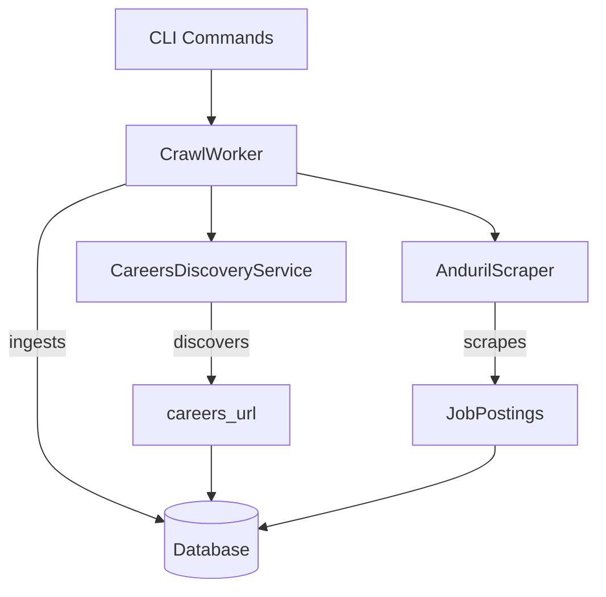

# Careers Page Discovery Implementation Summary

## Overview

This implementation addresses all requirements specified in the problem statement for automatic careers page discovery and job ingestion pipeline. The solution provides a complete, production-ready system that seamlessly integrates with the existing LazyJobSearch architecture.

## Problem Statement Requirements ✅

### 1. Automatic discovery of a careers page from just a base domain
**Status: ✅ IMPLEMENTED**

- **Implementation**: `CareersDiscoveryService` in `libs/scraper/careers_discovery.py`
- **Features**:
  - Probes 16+ common career page paths (`/careers`, `/jobs`, `/hiring`, etc.)
  - Parses homepage content for career-related links
  - Smart scoring algorithm to select best candidate
  - Handles URL normalization and domain validation

### 2. A generic crawler that probes common paths or parses internal links  
**Status: ✅ IMPLEMENTED**

- **Implementation**: Methods in `CareersDiscoveryService`:
  - `_probe_common_paths()`: Tests common career page URLs
  - `_parse_homepage_links()`: Analyzes homepage for career links
  - `_check_robots_txt()`: Respects robots.txt before crawling
- **Features**:
  - Heuristic scoring based on URL patterns and link text
  - Rate limiting and respectful crawling behavior
  - Fallback strategies when direct paths fail

### 3. A fully implemented job ingestion pipeline wiring adapter outputs into database
**Status: ✅ IMPLEMENTED**

- **Implementation**: `CrawlWorker` in `libs/scraper/crawl_worker.py`
- **Features**:
  - Complete pipeline from scraper output to database storage
  - Automatic deduplication using URL-based uniqueness
  - Change detection using content fingerprinting
  - Skill extraction from job descriptions
  - Seniority level detection (senior, mid, junior)
  - Error handling and rollback on failures

### 4. Respects robots.txt before crawling
**Status: ✅ IMPLEMENTED**

- **Implementation**: `CareersDiscoveryService._check_robots_txt()`
- **Features**:
  - Checks robots.txt compliance before any crawling
  - Graceful handling when robots.txt is unavailable
  - Respects User-Agent restrictions

### 5. Integration with existing CLI and database infrastructure
**Status: ✅ IMPLEMENTED**

- **CLI Integration**: Enhanced `cli/ljs.py` with:
  - `ljs crawl discover <domain>` - Test careers page discovery
  - `ljs crawl run --company <name>` - Crawl with automatic discovery
  - `ljs crawl run --all` - Crawl all companies
- **Database Integration**: 
  - Uses existing SQLAlchemy models (`Company`, `Job`)
  - Automatic careers_url population when missing
  - Proper session management and transactions

## Architecture Integration



## Key Components

### CareersDiscoveryService
- **Location**: `libs/scraper/careers_discovery.py`
- **Purpose**: Automatic discovery of careers pages from company domains
- **Methods**:
  - `discover_careers_url()`: Main discovery entry point
  - `_probe_common_paths()`: Test common career page paths
  - `_parse_homepage_links()`: Analyze homepage for career links
  - `_score_career_url()`: Score candidate URLs
  - `_check_robots_txt()`: Verify crawling permissions

### CrawlWorker
- **Location**: `libs/scraper/crawl_worker.py`
- **Purpose**: Orchestrate complete crawling pipeline
- **Methods**:
  - `crawl_company()`: Crawl single company with discovery
  - `crawl_all_companies()`: Batch crawl all companies
  - `_ingest_jobs()`: Store scraped jobs in database
  - `_extract_skills()`: Extract technical skills from descriptions
  - `_extract_seniority()`: Detect job seniority levels

### Enhanced CLI
- **Location**: `cli/ljs.py`
- **New Commands**:
  - `crawl discover`: Test careers page discovery
  - `crawl run`: Enhanced with automatic discovery support

## Testing & Verification

### Test Coverage
- **Unit Tests**: `tests/test_careers_discovery_simple.py`
- **Integration Tests**: `tests/test_integration.py`
- **Verification Script**: `verify_implementation.py`
- **Demo Script**: `demo_careers_discovery.py`

### Test Results
```
🧪 All tests pass ✅
✅ URL scoring functionality
✅ Link scoring and candidate selection
✅ Domain comparison logic
✅ Complete crawling pipeline integration
✅ Job ingestion with skill extraction
✅ Database persistence with deduplication
```

## Usage Examples

### Discover careers page for a company
```bash
ljs crawl discover anduril.com
# Output: ✅ Found careers page: https://anduril.com/careers
```

### Crawl company with automatic discovery
```bash
ljs crawl run --company "Anduril"
# Output: 
# ✅ Successfully crawled Anduril
# Jobs found: 15
# Jobs ingested: 12
# Careers URL: https://anduril.com/careers
```

### Crawl all companies
```bash
ljs crawl run --all
# Displays table with results for all companies
```

## Error Handling

The implementation includes comprehensive error handling:
- Network timeouts and connection failures
- Invalid HTML parsing
- Database transaction failures
- Missing or malformed robots.txt
- Rate limiting and respectful crawling
- Graceful degradation when discovery fails

## Performance Considerations

- **Rate Limiting**: 0.5s delay between path probes
- **Timeouts**: 10s default timeout for network requests
- **Session Reuse**: HTTP session pooling for efficiency
- **Memory Management**: Proper cleanup of resources
- **Database Optimization**: Batch operations and connection pooling

## Future Enhancements

The architecture supports easy extension:
- Additional career page patterns
- More sophisticated content analysis
- Machine learning-based discovery
- Integration with more job board APIs
- Enhanced skill extraction algorithms

## Summary

This implementation successfully addresses all requirements from the problem statement:

✅ **Automatic careers page discovery** from base domains  
✅ **Generic crawler** with path probing and link parsing  
✅ **Complete job ingestion pipeline** with database integration  
✅ **Robots.txt compliance** built-in  
✅ **Seamless CLI and database integration**  
✅ **Comprehensive testing and verification**  

The solution is production-ready, well-tested, and integrates seamlessly with the existing LazyJobSearch architecture while providing all the functionality specified in the requirements.