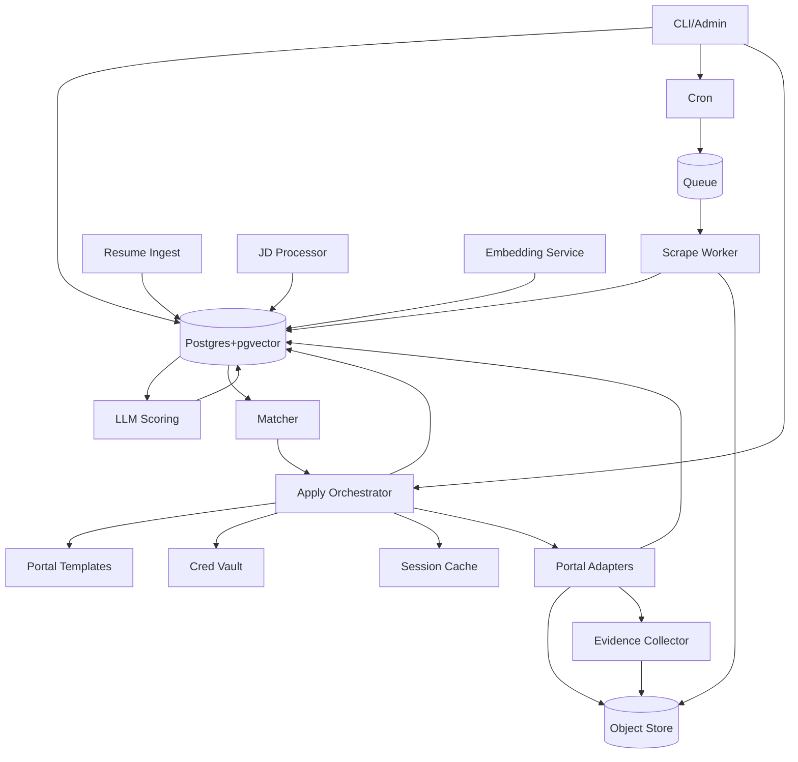
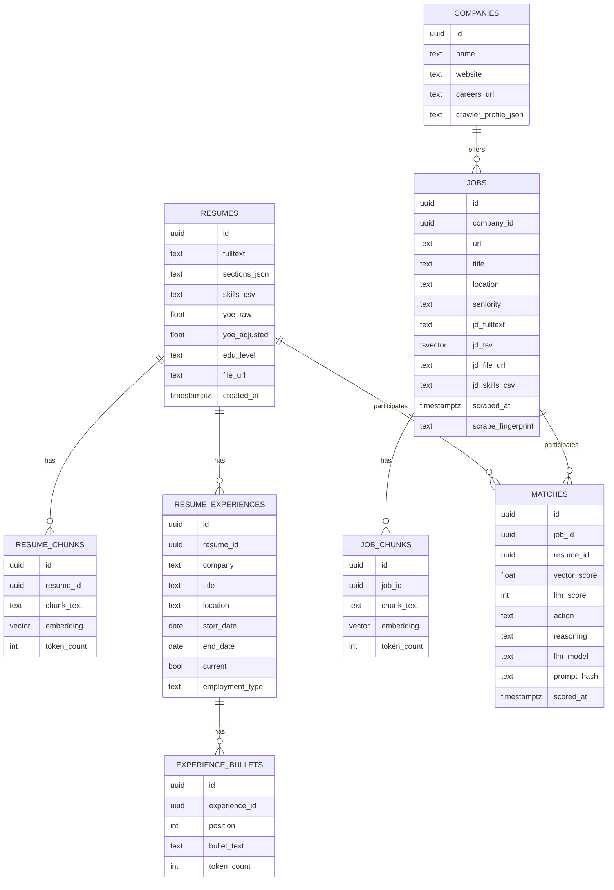
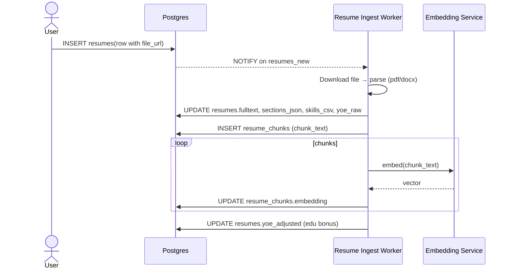
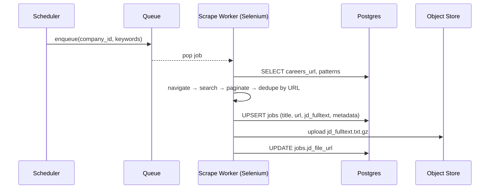
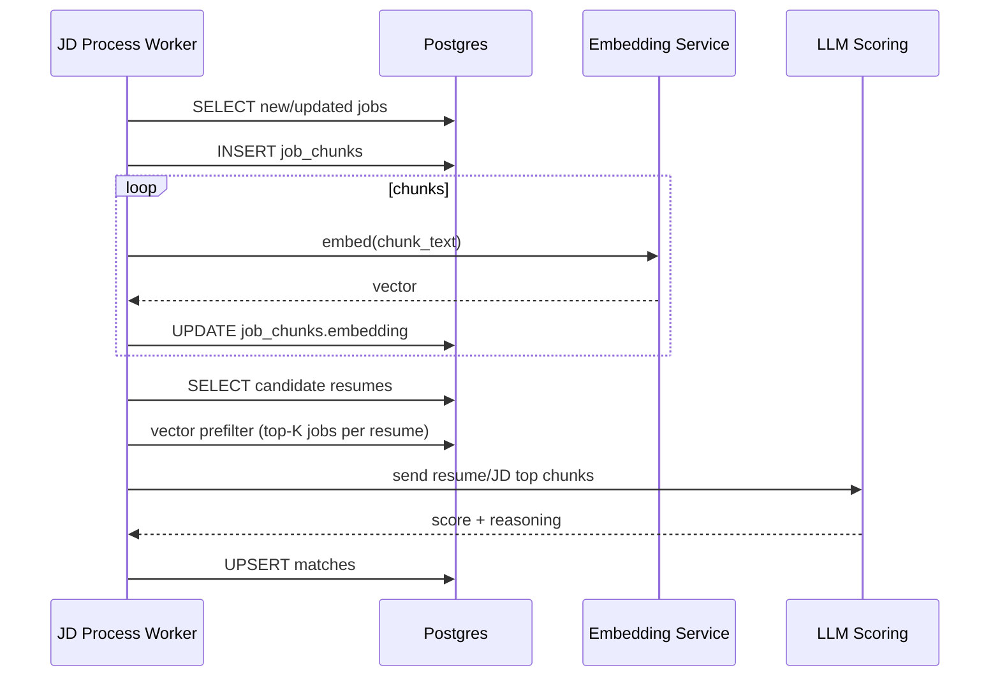
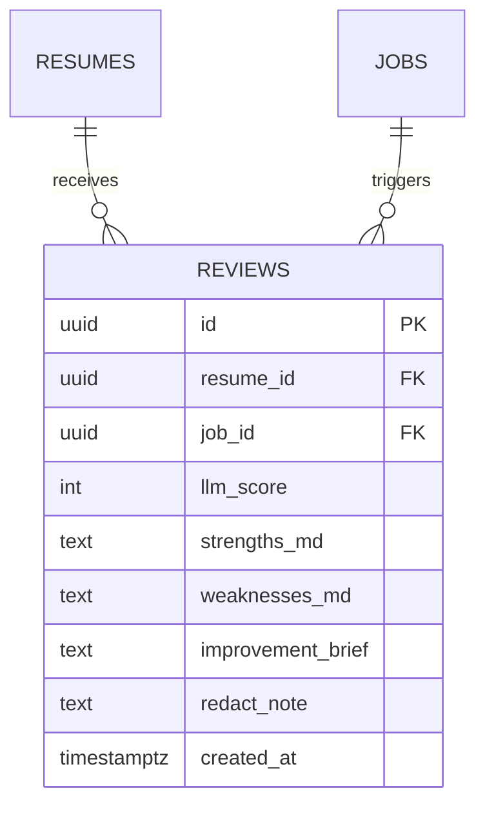
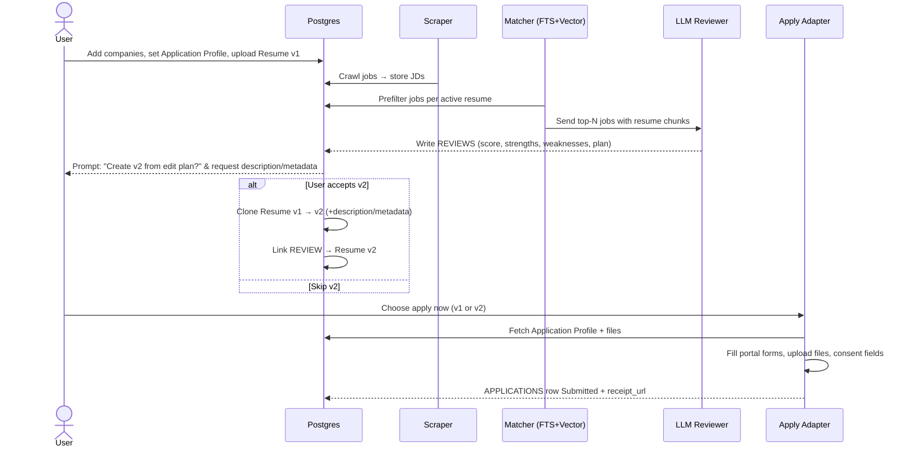

# LazyJobSearch

Full architecture & system design has moved to `docs/ARCHITECTURE.md`.

## What Is This?
LazyJobSearch ingests resumes, crawls & embeds job descriptions, prefilters with FTS + vector similarity, scores matches via LLM, and (optionally) auto‑applies using portal templates with secure credential handling.

## Quick Start (planned)
1. Start infra (Compose: Postgres+pgvector, Redis, MinIO)
2. Seed companies & portal configs
3. Upload resume via CLI
4. Run crawler & JD processor
5. Generate matches
6. (Optional) Auto‑apply selected matches

## CLI (Interim Interaction Model)
While the web frontend is in design, a terminal CLI enables full workflow automation. See `docs/CLI_DESIGN.md`.

Example (stubbed today):
```
python -m cli.ljs config init
python -m cli.ljs resume ingest ./tests/jd_tarriela.pdf
python -m cli.ljs match run --resume latest --limit 50
python -m cli.ljs review start <job_id>
python -m cli.ljs apply run <job_id> --dry-run
```
Add `--json` for machine-readable output. Configuration precedence: defaults < `~/.lazyjobsearch/config.yaml` < `./lazyjobsearch.yaml` < env vars `LJS_*` < flags.

## Documentation
See `docs/ARCHITECTURE.md` for:
* High-level & apply-extended architecture diagrams
* Complete ER model (experiences, bullets, reviews, applications)
* Sequence diagrams (ingest, crawl, match, apply)
* Auto-apply template DSL & events/artifacts schema
* Security, observability, roadmap

## Contributing
Open issues for new adapters, template DSL changes, or schema evolution. Keep the root README minimal; add deep docs under `docs/`.

---
Maintained design: `docs/ARCHITECTURE.md`
# Job-Match Scraper System Design (Python + Selenium + Postgres/pgvector)

**Goal:** <br>	End‑to‑end pipeline to: <br>	(1) ingest & parse resumes, <br>	(2) crawl company career sites with Selenium, <br>	(3) store & compress job descriptions, <br>	(4) tokenize & embed resume/JD chunks, <br>	(5) pre‑filter with FTS & vector similarity, and <br>	(6) LLM‑score best matches.

---

## 1) High-Level Architecture (C4-ish)



**Notes**

* Orchestration via cron, Airflow, or Celery beat. Queue via Redis/Rabbit for scalable workers.
* Postgres is the **system of record**. Object store for large artifacts (compressed JDs, original resumes).
* `pgvector` holds embeddings; Postgres `tsvector` indexes support keyword search.

---

## 2) Core Data Model (ER/Relational)



**Experience Modeling Notes**

* `RESUME_EXPERIENCES` captures structured roles (company, title, dates, current flag, employment type).
* `EXPERIENCE_BULLETS` stores ordered responsibility/impact statements; `position` preserves ordering.
* Bullets can later be embedded directly or merged into `RESUME_CHUNKS` if desired. Keeping them separate gives finer‑grained control for skill extraction & delta updates.
* Potential future tables: `EXPERIENCE_SKILLS (experience_id, skill, source)` or normalization of companies.

**Indexes & Extensions**

* `CREATE EXTENSION vector; CREATE EXTENSION pg_trgm;`
* `CREATE INDEX jobs_jd_tsv_gin ON jobs USING GIN (jd_tsv);`
* `CREATE INDEX job_chunks_embed_ivfflat ON job_chunks USING ivfflat (embedding vector_cosine_ops) WITH (lists = 100);`
* `CREATE INDEX resume_chunks_embed_ivfflat ON resume_chunks USING ivfflat (embedding vector_cosine_ops) WITH (lists = 100);`
* `CREATE UNIQUE INDEX jobs_url_uidx ON jobs(url);`

**Triggers**

* BEFORE INSERT/UPDATE on `jobs`: `jd_tsv := to_tsvector('english', jd_fulltext)`.
* (Optional) hash `jd_fulltext` → `scrape_fingerprint` for change detection.

---

## 3) Key Sequences (UML)

### 3.1 Resume Ingest & Embedding



### 3.2 Company Crawl & JD Storage



### 3.3 JD Embedding & Matching



---

## 4) Python Service Layout (monorepo suggestion)

```
repo/
  apps/
    scraper/           # Selenium workers, site profiles
    resume_ingest/     # pdf/docx parsing → sections, chunks
    jd_processor/      # chunking & embeddings for jobs
    matcher/           # FTS + vector prefilter + LLM scoring
    api/               # FastAPI (optional) for admin/ops
  libs/
    db/                # SQLAlchemy models + Alembic migrations
    nlp/               # chunkers, cleaners, skills extractors
    embed/             # embedding client wrappers
    llm/               # scoring prompts & client
    utils/             # logging, tracing, retry, backoff
  deploy/
    docker/            # Dockerfiles, compose/k8s manifests
    terraform/         # (optional) VPC, RDS, S3
```

**Key Tech**

* **Web**: Selenium + undetected‑chromedriver, playwright (fallback), robots.txt check, per‑site adapter.
* **API** (optional): FastAPI for internal dashboards & ops.
* **Queue**: Celery (Redis/Rabbit) or Dramatiq.
* **DB**: Postgres 16 + pgvector 0.7+, SQLAlchemy 2.x + Alembic.
* **Parsing**: pdfminer.six / pypdf / textract / docx2python.
* **Embedding**: OpenAI text-embedding-3-large (or local alternative later).
* **LLM**: GPT‑4.1/4o‑mini for scoring; pluggable provider.

---

## 5) Feature Set — Add vs. Redundant

### Must‑Have (MVP)

* Resume upload + parsing to sections & fulltext
* YOE computation (+ education bonus rule)
* Company list → careers discovery (seeded URLs OK)
* Selenium scraper with per‑site config (search keywords from skills)
* Store JD fulltext + compressed artifact
* Chunk & embed (resume + JD)
* FTS prefilter + vector similarity top‑K
* LLM scoring (0–100) + reasons/gaps → `matches`
* Daily digest of top matches
* Additional key words for search.. (SHPE Conference, NSBE, SASE) 

### Phase 2 (High ROI)

* Playwright fallback for tougher sites
* Headless/Headful switching with humanization (sleep/jitter)
* Change detection: re‑embed only when JD changed
* Skill taxonomy & normalization (e.g., spaCy patterns + curated list)
* Cover letter generator with traceability to JD bullets
* Simple Admin UI (FastAPI + HTMX or small React) for triage
* Network warm‑intro recommender (import contacts/LinkedIn URLs you provide)

### Defer / Potentially Redundant

* Separate vector DB (Pinecone/Qdrant) — **redundant** initially; pgvector suffices
* Full‑text engine (Elastic/OpenSearch) — **defer** until query volumes or complex relevancy require it
* Distributed orchestration (Airflow) — use Celery beat/cron first
* Knowledge graph linking — not needed early

---

## 6) Scraper Design Details

* **Per‑site adapter** interface: `search(query_terms) -> list[JobPosting]` with pagination & rate caps.
* **Anti‑bot hygiene**: rotate user‑agents, backoff on 429, respect robots.txt, randomized think time, no parallel clicks on same host.
* **Idempotency**: `url` unique; UPSERT (`ON CONFLICT (url) DO UPDATE`); `scrape_fingerprint` for diffing.
* **Error handling**: screenshot + HTML snapshot on failure; structured error rows.
* **Config**: YAML per company (selectors, search fields, pagination buttons, filters).

---

## 7) Matching Algorithm (cheap → precise)

1. **Keyword prefilter**: `jobs.jd_tsv @@ websearch_to_tsquery(:q)` where `:q` is synthesized from resume top skills.
2. **Vector prefilter**: cosine similarity on `job_chunks.embedding` vs aggregated resume embedding (mean or max‑pool over top resume chunks).
3. **LLM scorer**: prompt with top‑N overlapping chunks (both sides), ask for JSON result with score/reasons/gaps and recommendation.

**Thresholds**

* Consider jobs with `cosine >= 0.78` and `FTS rank >= R_min`.
* Calibrate with a validation set of hand‑labeled good/bad matches.

---

## 8) Database DDL Highlights (Postgres)

```sql
CREATE EXTENSION IF NOT EXISTS vector;
CREATE EXTENSION IF NOT EXISTS pg_trgm;

-- Jobs FTS
ALTER TABLE jobs ADD COLUMN jd_tsv tsvector;
CREATE INDEX jobs_jd_tsv_gin ON jobs USING GIN (jd_tsv);
CREATE OR REPLACE FUNCTION jobs_tsv_update() RETURNS trigger AS $$
BEGIN
  NEW.jd_tsv := to_tsvector('english', coalesce(NEW.jd_fulltext, ''));
  RETURN NEW;
END; $$ LANGUAGE plpgsql;
CREATE TRIGGER trg_jobs_tsv BEFORE INSERT OR UPDATE ON jobs
FOR EACH ROW EXECUTE FUNCTION jobs_tsv_update();

-- Vector indexes
CREATE INDEX job_chunks_embed_ivfflat ON job_chunks USING ivfflat (embedding vector_cosine_ops) WITH (lists = 100);
CREATE INDEX resume_chunks_embed_ivfflat ON resume_chunks USING ivfflat (embedding vector_cosine_ops) WITH (lists = 100);

-- URL de-dupe
CREATE UNIQUE INDEX jobs_url_uidx ON jobs(url);
```

---

## 9) Security, Privacy, Compliance

* **Secrets** via environment (Docker/K8s secrets). No secrets in code.
* **PII minimization**: store only resume details necessary for matching; redact personal identifiers in chunks if possible.
* **Provider logs**: opt‑out of training; send minimal context (only top chunks, not entire resume).
* **Robots/ToS**: respect site terms; allow blocklist/allowlist per domain.

---

## 10) Observability & Ops

* **Logging**: struct logs (JSON) with job\_id, company\_id, url, status\_code.
* **Metrics**: scrape success rate, pages/min, dedupe rate, embedding latency, cosine distribution, LLM cost per match.
* **Tracing**: OpenTelemetry optional; at least correlation IDs across workers.
* **Dead-letter**: failed scrape jobs → DLQ table with reason & retry policy.

---

## 11) Cost & Performance Controls

* Batch embeddings; cache identical chunks.
* Use smaller embedding model where acceptable.
* LLM only on vector‑passed jobs; cap daily evals.
* Re‑embed JD only on fingerprint change.

---

## 12) Testing Strategy

* **Scraper**: site fixtures (saved HTML), deterministic parsers, contract tests per adapter.
* **NLP**: chunker unit tests (boundaries, overlap), token counts.
* **DB**: alembic migration tests; pgvector similarity sanity tests.
* **E2E**: run a tiny pipeline against 2–3 known sites (staging DB).

---

## 13) Deployment

* **Local**: Docker Compose (Postgres+pgvector, MinIO, Redis, workers, optional FastAPI UI).
* **Cloud**: ECS/EKS or Fly.io; RDS Postgres; S3; ElastiCache/Redis.
* **CI/CD**: GitHub Actions → lint/test → build images → deploy.

---

## 14) Roadmap & Feature Triage

### MVP (Weeks 0–2)

* Postgres schema + Alembic, Docker Compose
* Resume ingest → sections + chunks + embeddings
* Company seeds + 2–3 site adapters (Selenium)
* JD store + compression to S3/MinIO
* JD chunk + embed
* FTS + vector prefilter
* LLM scoring + matches table
* Daily digest (email)

### Phase 2 (Weeks 3–5)

* Robust adapter framework & config registry
* Playwright fallback; anti‑bot improvements
* Admin dashboard (list jobs, matches, errors)
* Cover letter generator
* Change detection + partial reprocessing

### Phase 3 (Weeks 6+)

* Social/warm‑intro module
* Multi‑resume A/B matching
* Advanced ranking with learned weights (logistic regression over features: FTS rank, cosine, Jaccard of skills, YOE gap)
* Optional OpenSearch integration

---

## 15) Open Questions / Decisions

* Education bonus policy: domain‑specific (MS=+1 year? MS=+2 in STEM?)
* Chunk size & overlap defaults; token model choice
* Resume PII redaction at chunk boundary
* Company rate limit defaults; global politeness policy
* Error budget for LLM/API failures (fallback scores?)

---

## 16) LLM Scoring Prompt (reference)

**System:** "Recruiting copilot; justify with concrete evidence; output strict JSON."
**User:** includes job metadata, YOE adjusted, JD top chunks, Resume top chunks; asks for `{score, apply_recommendation, top_reasons[], gaps[], notes}`.

---

## 17) What’s intentionally *not* in MVP (redundant now)

* Separate vector DB (adds ops complexity; pgvector is enough)
* Heavy distributed schedulers (Airflow) vs Celery beat/cron
* Elastic/OpenSearch (until search complexity demands it)
* Sophisticated KG/ontology (keep skills flat; normalize later)

---

*This document is the working spec. We can now spin out SQLAlchemy models + Alembic migration, Compose stack, and the first two Selenium adapters.*

---

## 18) New Requirements: User Accounts, Resume Versioning, LLM Review, and Auto‑Apply

### 18.1 User Accounts & Profile (PII) — Schema Additions

```mermaid
erDiagram
  USERS ||--o{ RESUMES : owns
  USERS ||--o{ USER_FILES : has

  USERS {
    uuid id PK
    text email UNIQUE
    text password_hash
    text full_name
    text phone
    text address_json
    text veteran_status
    text disability_status
    text ethnicity
    text work_auth_status
    text links_json
    timestamptz created_at
    timestamptz updated_at
    bool consent_data_use
  }
  USER_FILES {
    uuid id PK
    uuid user_id FK
    text kind
    text file_url
    text label
    timestamptz uploaded_at
  }
```

**Security**

* Encrypt at rest (Postgres TDE or disk-level; additionally `pgcrypto` for columns).
* Fine-grained consent flags for sensitive fields (ethnicity/disability). Avoid sending sensitive PII to LLMs.

### 18.2 Resume Versioning & Metadata

Extend `RESUMES`:

* `version` (int, default 1)
* `parent_resume_id` (uuid, nullable) // chain for lineage
* `metadata_tags` (text\[]) // user-provided keywords
* `description` (text) // user-provided v2 summary
* `active` (bool) // which version is used by default

**Versioning Rules**

* New LLM-tailored revision → create `RESUMES` v2 with `parent_resume_id` pointing to v1.
* Reuse chunks/embeddings when unchanged; re-embed only diff sections.

### 18.3 LLM Strengths & Weaknesses per Posting

Add table `REVIEWS` for deterministic storage of job-specific feedback:



**Prompt Output Contract**

* JSON with `score, strengths[], weaknesses[], edit_plan`.
* Store bullets in Markdown for easy UI rendering.

### 18.4 Interactive Flow: Offer Free Resume Update ("v2")

**State Machine (simplified)**

* `REVIEWED` → ask user: *“Create Resume v2 tailored to this job?”*
* If **Yes**:

  * Create `RESUMES` v2 (copy v1, apply edit plan), set `description` prompt to user for metadata, set `active=false` by default.
  * Re-chunk & (delta) embed.
  * Link v2 to this `REVIEWS` row.
* If **No**:

  * Proceed to Auto‑Apply with currently active resume.

**UI Prompts** (API/CLI acceptable)

* `description` (required) → becomes `RESUMES.description` & `metadata_tags` extraction.

### 18.5 Auto‑Apply with Predefined Fields

Add table `APPLICATION_PROFILES`:

```mermaid
erDiagram
  USERS ||--o{ APPLICATION_PROFILES : maintains
  APPLICATION_PROFILES {
    uuid id PK
    uuid user_id FK
    text profile_name
    text answers_json   // {veteran, ethnicity, disability, work_auth, relocation, salary_expectation, phone, address, etc.}
    text files_map_json // {resume: file_id, cover_letter: file_id, transcript: file_id}
    bool default_profile
    timestamptz updated_at
  }
```

**Selenium Apply Adapter**

* Per-site `apply()` method renders adapters for Greenhouse, Lever, Workday, Taleo, SuccessFactors.
* Pulls from `APPLICATION_PROFILES` and the selected `RESUMES` version.
* Uploads mapped files from `USER_FILES`.
* Saves submission receipts to `APPLICATIONS` table:

```sql
APPLICATIONS(
  id uuid PK,
  user_id uuid FK,
  job_id uuid FK,
  resume_id uuid FK,
  application_profile_id uuid FK,
  status text,         -- Draft|Submitted|Error
  portal text,         -- Greenhouse|Lever|Workday|...
  submitted_at timestamptz,
  receipt_url text,
  error_text text
)
```

### 18.6 Updated End‑to‑End Sequence



### 18.7 Consent, Compliance & Guardrails

* **Consent flags** per user for storing sensitive attributes (ethnicity/disability). If not consented, fields remain null and are never sent to LLM.
* **Scoped LLM context**: Only job/resume chunks; never send `APPLICATION_PROFILES`.
* **Audit**: Record `portal`, field map SHA, and DOM snapshots on submit for troubleshooting.
* **Rate & Ethics**: Respect ToS; throttle; add manual review toggle per site.

### 18.8 Feature Triage Update

**Must‑Have (MVP+)**

* Users + Application Profiles
* REVIEWS table and LLM strengths/weaknesses per job
* Resume v2 creation workflow with user-provided description/metadata
* Auto‑apply adapters for 2 major portals (e.g., Greenhouse, Lever)

**Phase 2**

* Additional portals (Workday, SuccessFactors, Taleo)
* Templateable Q\&A mapping per company (salary, relocation)
* Cover‑letter generator tied to chosen resume version
* Per‑job resume v2 caching (reuse for same company family)

**Defer**

* ATS integration via APIs (if a company exposes one)
* Multi‑user team roles/permissions
```

---

## 19) Auto-Apply & Application Tracking Architecture

### 19.1 Components

* **Apply Orchestrator**: Coordinates end-to-end apply flow (select template, login/session, execute steps, persist results).
* **Portal Template Library**: DSL-driven step definitions per ATS portal (Greenhouse, Lever, Workday, Taleo, SuccessFactors, Oracle, etc.).
* **Portal Adapters**: Runtime executor (Selenium/Playwright) interpreting templates; handles waits, retries, element resolution.
* **Credential Vault & Session Cache**: Secure storage for user credentials (encrypted) + reusable cookie jars/session tokens.
* **Evidence Collector**: Captures DOM snapshot, screenshot, optional PDF/HTML receipt, and stores metadata.
* **Application Events & Artifacts Stores**: Append-only history + blob references.
* **Interview Prep View**: Aggregates JD + resume version + LLM review + bullet alignment for user review.

### 19.2 Data Model Additions (Summary)

```
PORTALS(id, name, family, notes, created_at)
PORTAL_TEMPLATES(id, portal_id FK, version, dsl_json, is_active, created_at)
COMPANY_PORTAL_CONFIGS(id, company_id FK, portal_id FK, login_url, apply_base_url, quirks_json, created_at)
PORTAL_FIELD_DICTIONARY(id, key UNIQUE, description, required, pii_level, created_at)
USER_CREDENTIALS(id, user_id FK, portal_family, username, password_ciphertext, totp_secret_ciphertext, updated_at)
SESSIONS(id, user_id FK, portal_family, cookie_jar jsonb, expires_at, created_at)
APPLICATION_EVENTS(id, application_id FK, at, kind, detail_json)
APPLICATION_ARTIFACTS(id, application_id FK, type, url, sha256, created_at)
```

Recommended indexes: `(portal_id,is_active)`, `(company_id)`, `(user_id, portal_family)`, `(application_id, at)`.

### 19.3 Portal Template DSL (Excerpt)

```json
{
  "start": {"url": "{{apply_base_url}}"},
  "steps": [
    {"action":"click","selector":"button.apply"},
    {"action":"type","selector":"input[name=email]","value":"{{profile.email}}"},
    {"action":"upload","selector":"input[type=file][name=resume]","file":"{{files.resume}}"},
    {"action":"select","selector":"select[name=veteran]","value":"{{answers.veteran_status}}"},
    {"action":"radio","selector":"input[name=ethnicity][value='{{answers.ethnicity}}']"},
    {"action":"next"},
    {"action":"wait","until":"selector","selector":"button.submit"},
    {"action":"submit","selector":"button.submit"}
  ],
  "receipt": {"selector":"a.confirmation-link"},
  "validate": [
    {"selector":"div.error","severity":"warn"},
    {"selector":"#captcha","severity":"block"}
  ]
}
```

Values resolve from: application profile answers, file map, selected resume version, company portal config overrides.

### 19.4 Apply Flow (Lifecycle)

1. User selects a match → clicks Auto-Apply (chooses resume v1/v2 + application profile).
2. Orchestrator loads company portal config & active template.
3. Session retrieved or login performed (credentials decrypted in-memory only).
4. Template executed step-by-step (retry/backoff on transient failures).
5. Evidence captured (DOM, screenshot, receipt URL/ID).
6. `APPLICATION_EVENTS` appended for each stage; `APPLICATION_ARTIFACTS` for blobs.
7. Status transitions: `Draft → Filling → Submitted → Confirmed` (or `Error`).

### 19.5 Events & Artifacts

Sample events: `Created`, `Login`, `Filled`, `Submitted`, `ReceiptSaved`, `Error`, `FollowupDue`.

Artifacts types: `dom_snapshot`, `screenshot`, `pdf`, `receipt_html`.

### 19.6 Interview Prep Packet

Generated view (or cached PDF) containing:
* JD full text & requirement extraction
* Resume version used (+ diff vs baseline)
* LLM review (strengths / weaknesses / gaps / talking points)
* Skill alignment matrix (JD skill → present? → evidence bullet)
* Application metadata (submitted_at, portal, receipt, artifacts)

### 19.7 Security & Privacy

* Encrypt credentials & sensitive profile fields (pgcrypto/KMS).
* Strict service-layer access to `USER_CREDENTIALS`.
* No EEO / sensitive answers are sent to LLM prompts.
* Redact secrets & PII from logs; structured logging with correlation IDs.

### 19.8 Reliability & Guardrails

* Dry-run mode (simulate & capture form fill before submit).
* Selector drift detection → flag template for review.
* Captcha detection → pause + user notification.
* Exponential backoff & max retry counts per step.
* Rate limits per portal & per company.

### 19.9 Future Enhancements

* Heuristic portal inference for long-tail ATS.
* A/B resume strategy experiments (resume v1 vs v2 performance).
* Auto follow-up reminders (event scheduled N days post-submission).
* Adaptive field value suggestions (local model) with explicit opt-in.

---
