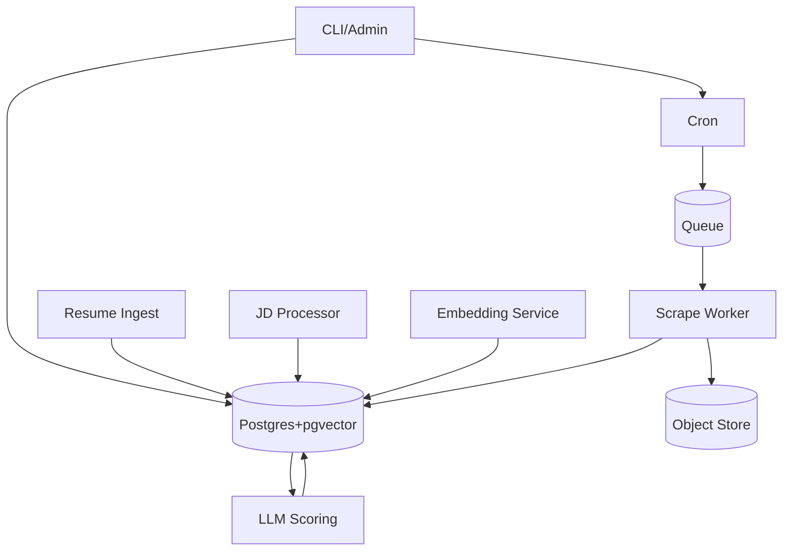
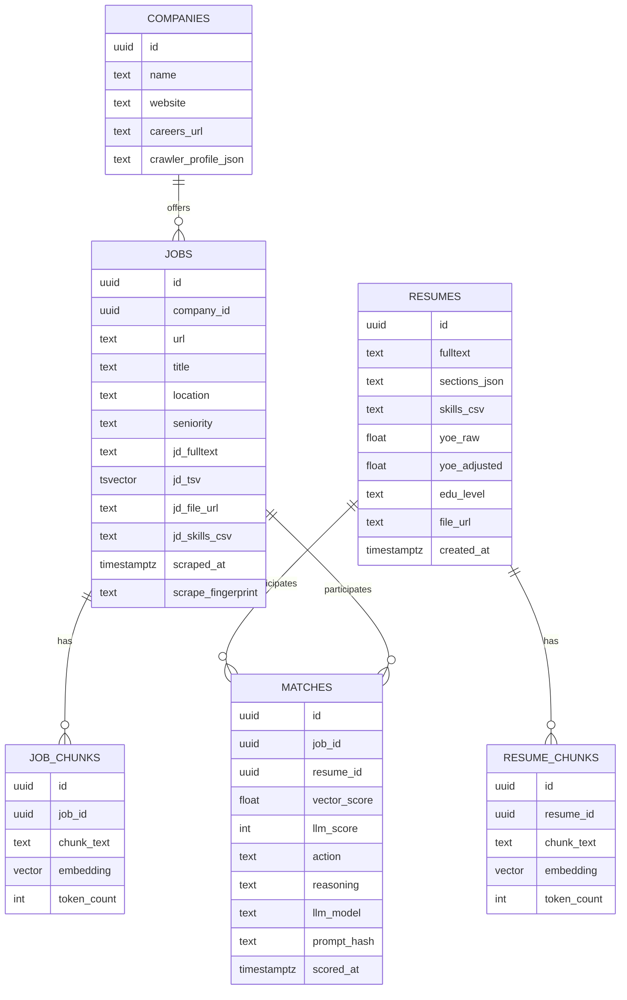
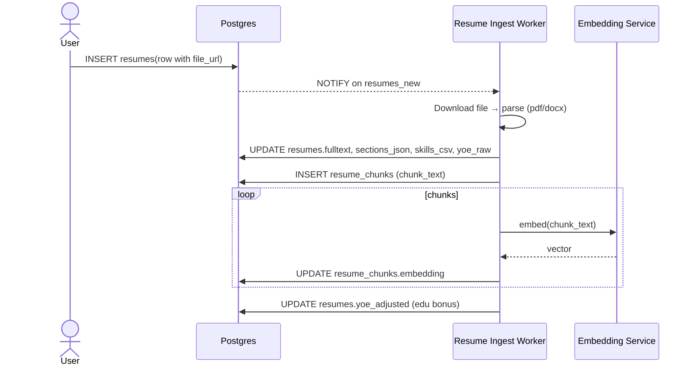
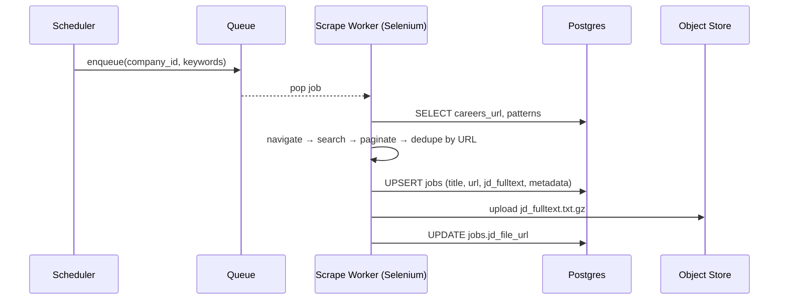
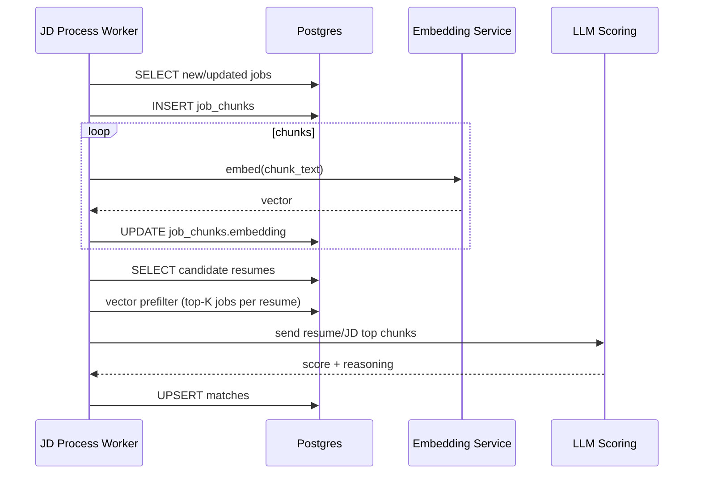
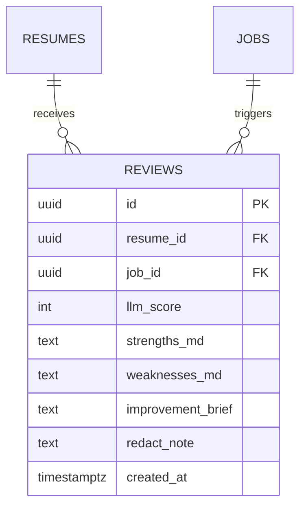
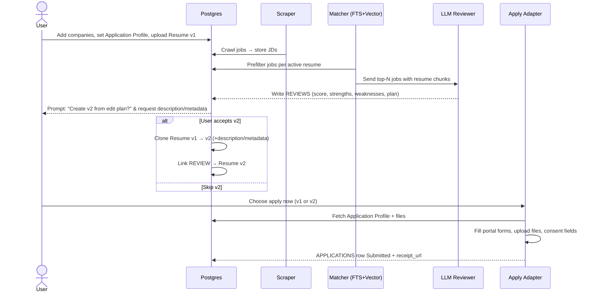
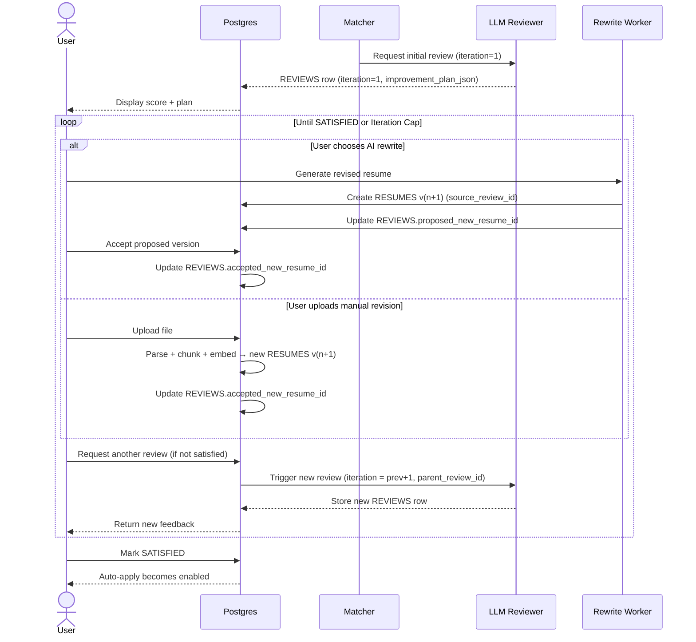
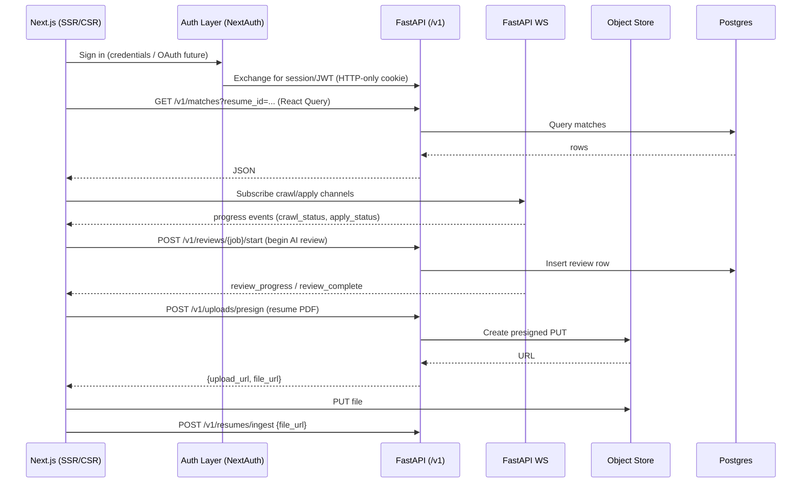

# Job-Match Scraper System Design (Python + Selenium + Postgres/pgvector)

**Goal:** <br>	End‑to‑end pipeline to: <br>	(1) ingest & parse resumes, <br>	(2) crawl company career sites with Selenium, <br>	(3) store & compress job descriptions, <br>	(4) tokenize & embed resume/JD chunks, <br>	(5) pre‑filter with FTS & vector similarity, and <br>	(6) LLM‑score best matches.

---

## 1) High-Level Architecture (C4-ish)



**Notes**

* Orchestration via cron, Airflow, or Celery beat. Queue via Redis/Rabbit for scalable workers.
* Postgres is the **system of record**. Object store for large artifacts (compressed JDs, original resumes).
* `pgvector` holds embeddings; Postgres `tsvector` indexes support keyword search.

---

## 2) Core Data Model (ER/Relational)



**Indexes & Extensions**

* `CREATE EXTENSION vector; CREATE EXTENSION pg_trgm;`
* `CREATE INDEX jobs_jd_tsv_gin ON jobs USING GIN (jd_tsv);`
* `CREATE INDEX job_chunks_embed_ivfflat ON job_chunks USING ivfflat (embedding vector_cosine_ops) WITH (lists = 100);`
* `CREATE INDEX resume_chunks_embed_ivfflat ON resume_chunks USING ivfflat (embedding vector_cosine_ops) WITH (lists = 100);`
* `CREATE UNIQUE INDEX jobs_url_uidx ON jobs(url);`

**Triggers**

* BEFORE INSERT/UPDATE on `jobs`: `jd_tsv := to_tsvector('english', jd_fulltext)`.
* (Optional) hash `jd_fulltext` → `scrape_fingerprint` for change detection.

---

## 3) Key Sequences (UML)

### 3.1 Resume Ingest & Embedding



### 3.2 Company Crawl & JD Storage



### 3.3 JD Embedding & Matching



---

## 4) Python Service Layout (monorepo suggestion)

```
repo/
  apps/
    scraper/           # Selenium workers, site profiles
    resume_ingest/     # pdf/docx parsing → sections, chunks
    jd_processor/      # chunking & embeddings for jobs
    matcher/           # FTS + vector prefilter + LLM scoring
    api/               # FastAPI (optional) for admin/ops
  libs/
    db/                # SQLAlchemy models + Alembic migrations
    nlp/               # chunkers, cleaners, skills extractors
    embed/             # embedding client wrappers
    llm/               # scoring prompts & client
    utils/             # logging, tracing, retry, backoff
  deploy/
    docker/            # Dockerfiles, compose/k8s manifests
    terraform/         # (optional) VPC, RDS, S3
```

**Key Tech**

* **Web**: Selenium + undetected‑chromedriver, playwright (fallback), robots.txt check, per‑site adapter.
* **API** (optional): FastAPI for internal dashboards & ops.
* **Queue**: Celery (Redis/Rabbit) or Dramatiq.
* **DB**: Postgres 16 + pgvector 0.7+, SQLAlchemy 2.x + Alembic.
* **Parsing**: pdfminer.six / pypdf / textract / docx2python.
* **Embedding**: OpenAI text-embedding-3-large (or local alternative later).
* **LLM**: GPT‑4.1/4o‑mini for scoring; pluggable provider.

---

## 5) Feature Set — Add vs. Redundant

### Must‑Have (MVP)

* Resume upload + parsing to sections & fulltext
* YOE computation (+ education bonus rule)
* Company list → careers discovery (seeded URLs OK)
* Selenium scraper with per‑site config (search keywords from skills)
* Store JD fulltext + compressed artifact
* Chunk & embed (resume + JD)
* FTS prefilter + vector similarity top‑K
* LLM scoring (0–100) + reasons/gaps → `matches`
* Daily digest of top matches

### Phase 2 (High ROI)

* Playwright fallback for tougher sites
* Headless/Headful switching with humanization (sleep/jitter)
* Change detection: re‑embed only when JD changed
* Skill taxonomy & normalization (e.g., spaCy patterns + curated list)
* Cover letter generator with traceability to JD bullets
* Simple Admin UI (FastAPI + HTMX or small React) for triage
* Network warm‑intro recommender (import contacts/LinkedIn URLs you provide)

### Defer / Potentially Redundant

* Separate vector DB (Pinecone/Qdrant) — **redundant** initially; pgvector suffices
* Full‑text engine (Elastic/OpenSearch) — **defer** until query volumes or complex relevancy require it
* Distributed orchestration (Airflow) — use Celery beat/cron first
* Knowledge graph linking — not needed early

---

## 6) Scraper Design Details

* **Per‑site adapter** interface: `search(query_terms) -> list[JobPosting]` with pagination & rate caps.
* **Anti‑bot hygiene**: rotate user‑agents, backoff on 429, respect robots.txt, randomized think time, no parallel clicks on same host.
* **Idempotency**: `url` unique; UPSERT (`ON CONFLICT (url) DO UPDATE`); `scrape_fingerprint` for diffing.
* **Error handling**: screenshot + HTML snapshot on failure; structured error rows.
* **Config**: YAML per company (selectors, search fields, pagination buttons, filters).

---

## 7) Matching Algorithm (cheap → precise)

1. **Keyword prefilter**: `jobs.jd_tsv @@ websearch_to_tsquery(:q)` where `:q` is synthesized from resume top skills.
2. **Vector prefilter**: cosine similarity on `job_chunks.embedding` vs aggregated resume embedding (mean or max‑pool over top resume chunks).
3. **LLM scorer**: prompt with top‑N overlapping chunks (both sides), ask for JSON result with score/reasons/gaps and recommendation.

**Thresholds**

* Consider jobs with `cosine >= 0.78` and `FTS rank >= R_min`.
* Calibrate with a validation set of hand‑labeled good/bad matches.

---

## 8) Database DDL Highlights (Postgres)

```sql
CREATE EXTENSION IF NOT EXISTS vector;
CREATE EXTENSION IF NOT EXISTS pg_trgm;

-- Jobs FTS
ALTER TABLE jobs ADD COLUMN jd_tsv tsvector;
CREATE INDEX jobs_jd_tsv_gin ON jobs USING GIN (jd_tsv);
CREATE OR REPLACE FUNCTION jobs_tsv_update() RETURNS trigger AS $$
BEGIN
  NEW.jd_tsv := to_tsvector('english', coalesce(NEW.jd_fulltext, ''));
  RETURN NEW;
END; $$ LANGUAGE plpgsql;
CREATE TRIGGER trg_jobs_tsv BEFORE INSERT OR UPDATE ON jobs
FOR EACH ROW EXECUTE FUNCTION jobs_tsv_update();

-- Vector indexes
CREATE INDEX job_chunks_embed_ivfflat ON job_chunks USING ivfflat (embedding vector_cosine_ops) WITH (lists = 100);
CREATE INDEX resume_chunks_embed_ivfflat ON resume_chunks USING ivfflat (embedding vector_cosine_ops) WITH (lists = 100);

-- URL de-dupe
CREATE UNIQUE INDEX jobs_url_uidx ON jobs(url);
```

---

## 9) Security, Privacy, Compliance

* **Secrets** via environment (Docker/K8s secrets). No secrets in code.
* **PII minimization**: store only resume details necessary for matching; redact personal identifiers in chunks if possible.
* **Provider logs**: opt‑out of training; send minimal context (only top chunks, not entire resume).
* **Robots/ToS**: respect site terms; allow blocklist/allowlist per domain.

---

## 10) Observability & Ops

* **Logging**: struct logs (JSON) with job_id, company_id, url, status_code.
* **Metrics**: scrape success rate, pages/min, dedupe rate, embedding latency, cosine distribution, LLM cost per match.
* **Tracing**: OpenTelemetry optional; at least correlation IDs across workers.
* **Dead-letter**: failed scrape jobs → DLQ table with reason & retry policy.

---

## 11) Cost & Performance Controls

* Batch embeddings; cache identical chunks.
* Use smaller embedding model where acceptable.
* LLM only on vector‑passed jobs; cap daily evals.
* Re‑embed JD only on fingerprint change.

---

## 12) Testing Strategy

* **Scraper**: site fixtures (saved HTML), deterministic parsers, contract tests per adapter.
* **NLP**: chunker unit tests (boundaries, overlap), token counts.
* **DB**: alembic migration tests; pgvector similarity sanity tests.
* **E2E**: run a tiny pipeline against 2–3 known sites (staging DB).

---

## 13) Deployment

* **Local**: Docker Compose (Postgres+pgvector, MinIO, Redis, workers, optional FastAPI UI).
* **Cloud**: ECS/EKS or Fly.io; RDS Postgres; S3; ElastiCache/Redis.
* **CI/CD**: GitHub Actions → lint/test → build images → deploy.

---

## 14) Roadmap & Feature Triage

### MVP (Weeks 0–2)

* Postgres schema + Alembic, Docker Compose
* Resume ingest → sections + chunks + embeddings
* Company seeds + 2–3 site adapters (Selenium)
* JD store + compression to S3/MinIO
* JD chunk + embed
* FTS + vector prefilter
* LLM scoring + matches table
* Daily digest (email)

### Phase 2 (Weeks 3–5)

* Robust adapter framework & config registry
* Playwright fallback; anti‑bot improvements
* Admin dashboard (list jobs, matches, errors)
* Cover letter generator
* Change detection + partial reprocessing

### Phase 3 (Weeks 6+)

* Social/warm‑intro module
* Multi‑resume A/B matching
* Advanced ranking with learned weights (logistic regression over features: FTS rank, cosine, Jaccard of skills, YOE gap)
* Optional OpenSearch integration

---

## 15) Open Questions / Decisions

* Education bonus policy: domain‑specific (MS=+1 year? MS=+2 in STEM?)
* Chunk size & overlap defaults; token model choice
* Resume PII redaction at chunk boundary
* Company rate limit defaults; global politeness policy
* Error budget for LLM/API failures (fallback scores?)

---

## 16) LLM Scoring Prompt (reference)

**System:** "Recruiting copilot; justify with concrete evidence; output strict JSON."
**User:** includes job metadata, YOE adjusted, JD top chunks, Resume top chunks; asks for `{score, apply_recommendation, top_reasons[], gaps[], notes}`.

---

## 17) What’s intentionally *not* in MVP (redundant now)

* Separate vector DB (adds ops complexity; pgvector is enough)
* Heavy distributed schedulers (Airflow) vs Celery beat/cron
* Elastic/OpenSearch (until search complexity demands it)
* Sophisticated KG/ontology (keep skills flat; normalize later)

---

*This document is the working spec. We can now spin out SQLAlchemy models + Alembic migration, Compose stack, and the first two Selenium adapters.*

---

## 18) New Requirements: User Accounts, Resume Versioning, LLM Review, and Auto‑Apply

### 18.1 User Accounts & Profile (PII) — Schema Additions

```mermaid
erDiagram
  USERS ||--o{ RESUMES : owns
  USERS ||--o{ USER_FILES : has

  USERS {
    uuid id PK
    text email UNIQUE
    text password_hash
    text full_name
    text phone
    text address_json
    text veteran_status
    text disability_status
    text ethnicity
    text work_auth_status
    text links_json
    timestamptz created_at
    timestamptz updated_at
    bool consent_data_use
  }
  USER_FILES {
    uuid id PK
    uuid user_id FK
    text kind
    text file_url
    text label
    timestamptz uploaded_at
  }
```

**Security**

* Encrypt at rest (Postgres TDE or disk-level; additionally `pgcrypto` for columns).
* Fine-grained consent flags for sensitive fields (ethnicity/disability). Avoid sending sensitive PII to LLMs.

### 18.2 Resume Versioning & Metadata

Extend `RESUMES`:

* `version` (int, default 1)
* `parent_resume_id` (uuid, nullable) // chain for lineage
* `metadata_tags` (text[]) // user-provided keywords
* `description` (text) // user-provided v2 summary
* `active` (bool) // which version is used by default

**Versioning Rules**

* New LLM-tailored revision → create `RESUMES` v2 with `parent_resume_id` pointing to v1.
* Reuse chunks/embeddings when unchanged; re-embed only diff sections.

### 18.3 LLM Strengths & Weaknesses per Posting

Add table `REVIEWS` for deterministic storage of job-specific feedback:



**Prompt Output Contract**

* JSON with `score, strengths[], weaknesses[], edit_plan`.
* Store bullets in Markdown for easy UI rendering.

### 18.4 Interactive Flow: Offer Free Resume Update ("v2")

**State Machine (simplified)**

* `REVIEWED` → ask user: *“Create Resume v2 tailored to this job?”*
* If **Yes**:

  * Create `RESUMES` v2 (copy v1, apply edit plan), set `description` prompt to user for metadata, set `active=false` by default.
  * Re-chunk & (delta) embed.
  * Link v2 to this `REVIEWS` row.
* If **No**:

  * Proceed to Auto‑Apply with currently active resume.

**UI Prompts** (API/CLI acceptable)

* `description` (required) → becomes `RESUMES.description` & `metadata_tags` extraction.

### 18.5 Auto‑Apply with Predefined Fields

Add table `APPLICATION_PROFILES`:

```mermaid
erDiagram
  USERS ||--o{ APPLICATION_PROFILES : maintains
  APPLICATION_PROFILES {
    uuid id PK
    uuid user_id FK
    text profile_name
    text answers_json   // {veteran, ethnicity, disability, work_auth, relocation, salary_expectation, phone, address, etc.}
    text files_map_json // {resume: file_id, cover_letter: file_id, transcript: file_id}
    bool default_profile
    timestamptz updated_at
  }
```

**Selenium Apply Adapter**

* Per-site `apply()` method renders adapters for Greenhouse, Lever, Workday, Taleo, SuccessFactors.
* Pulls from `APPLICATION_PROFILES` and the selected `RESUMES` version.
* Uploads mapped files from `USER_FILES`.
* Saves submission receipts to `APPLICATIONS` table:

```sql
APPLICATIONS(
  id uuid PK,
  user_id uuid FK,
  job_id uuid FK,
  resume_id uuid FK,
  application_profile_id uuid FK,
  status text,         -- Draft|Submitted|Error
  portal text,         -- Greenhouse|Lever|Workday|...
  submitted_at timestamptz,
  receipt_url text,
  error_text text
)
```

### 18.6 Updated End‑to‑End Sequence



### 18.7 Consent, Compliance & Guardrails

* **Consent flags** per user for storing sensitive attributes (ethnicity/disability). If not consented, fields remain null and are never sent to LLM.
* **Scoped LLM context**: Only job/resume chunks; never send `APPLICATION_PROFILES`.
* **Audit**: Record `portal`, field map SHA, and DOM snapshots on submit for troubleshooting.
* **Rate & Ethics**: Respect ToS; throttle; add manual review toggle per site.

### 18.8 Feature Triage Update

**Must‑Have (MVP+)**

* Users + Application Profiles
* REVIEWS table and LLM strengths/weaknesses per job
* Resume v2 creation workflow with user-provided description/metadata
* Auto‑apply adapters for 2 major portals (e.g., Greenhouse, Lever)

**Phase 2**

* Additional portals (Workday, SuccessFactors, Taleo)
* Templateable Q&A mapping per company (salary, relocation)
* Cover‑letter generator tied to chosen resume version
* Per‑job resume v2 caching (reuse for same company family)

**Defer**

* ATS integration via APIs (if a company exposes one)
* Multi‑user team roles/permissions

---

## 19) Iterative AI Resume Improvement Loop (New Addition)

### 19.1 Why This Addition
The previous sections (18.3–18.4) describe a single optional creation of a Resume v2 after an initial LLM review. They do NOT explicitly define a multi‑iteration loop where the user can repeatedly refine (either manually or via AI rewrite) and receive fresh feedback until satisfied. This section introduces that iterative capability.

### 19.2 Goals
* Allow multiple review → revise → re‑review cycles ("iterations") before applying.
* Track lineage: which review produced which revision.
* Provide both: (a) automated AI rewrite (apply edit plan) and (b) user‑uploaded manual revision.
* Enforce configurable iteration cap (default 3–4) to control LLM cost.
* Let user mark a resume version as “satisfied_for_job” to unblock auto‑apply.

### 19.3 Data Model Extensions
Augment existing tables instead of creating many new ones to keep migration simple.

REVIEWS (new / clarified columns)
* id (uuid PK)
* job_id (uuid FK)
* resume_id (uuid FK) — the resume version that was evaluated.
* iteration (int) — starts at 1 for the first review of a given job & root resume chain.
* parent_review_id (uuid, nullable) — points to the previous iteration's review; NULL for first.
* improvement_plan_json (jsonb) — structured version of `improvement_brief` (list of edit directives).
* status (text) — PENDING | COMPLETED | SUPERSEDED | CANCELLED.
* proposed_new_resume_id (uuid, nullable) — if an AI‑generated rewrite has been materialized but not yet accepted.
* accepted_new_resume_id (uuid, nullable) — the resume version the user chose to continue with (either AI or manual upload). If NULL and status COMPLETED → user skipped revision.
* satisfaction (text) — NULL | NEEDS_MORE | SATISFIED (user final decision for this job).

RESUMES (additional optional columns)
* source_review_id (uuid, nullable) — which review iteration generated or justified this version.
* iteration_index (int, nullable) — copies the review iteration for convenience (denormalized).

Optional (future) helper table for auditing diffs:
RESUME_EDIT_DIFFS(
  id uuid PK,
  from_resume_id uuid FK,
  to_resume_id uuid FK,
  diff_md text,
  changed_tokens int,
  created_at timestamptz
)

### 19.4 Iteration Lifecycle State Machine

States (per job + active resume lineage):
1. INITIAL_REVIEW_REQUESTED
2. REVIEWING (LLM generating review) → emits REVIEWS(iteration=1)
3. AWAITING_USER_DECISION
   * User options: ACCEPT_AI_REWRITE | UPLOAD_MANUAL | REQUEST_NEW_REVIEW | APPLY_NOW | STOP
4. APPLYING_AI_REWRITE (optional) → creates proposed_new_resume_id
5. MANUAL_UPLOAD_PENDING (user posts new file) → new resume parsed & embedded
6. REVISION_READY → user must ACCEPT (sets accepted_new_resume_id) or DISCARD (returns to AWAITING_USER_DECISION)
7. NEXT_ITERATION_REQUESTED → loop back to REVIEWING (iteration+1)
8. SATISFIED (user marks satisfaction) → gate cleared for Auto‑Apply
9. ABORTED (user stops early) → can still apply with last accepted resume

### 19.5 Sequence Diagram (Iterative Loop)


### 19.6 API / CLI Contract (Draft)
Endpoints (pseudo):
* POST /reviews/{job_id}/start → triggers iteration=1 if none exists.
* POST /reviews/{review_id}/rewrite (mode=auto) → queues AI rewrite.
* POST /reviews/{review_id}/upload → multipart file; returns new resume id.
* POST /reviews/{review_id}/next → creates next iteration (requires accepted resume version).
* POST /reviews/{review_id}/satisfied → sets satisfaction=SATISFIED, cascades to mark resume version as active for that job context.

### 19.7 LLM Rewrite Guardrails
* Hard cap: max_iterations_per_job (e.g., 4) stored in configuration.
* Cost estimator: track tokens per iteration; refuse further loops if monthly budget exceeded.
* Detect minimal change: if diff < threshold tokens & user requested new iteration → prompt user to supply additional guidance.

### 19.8 Prompt Strategy Enhancements
Two prompts:
1. REVIEW_PROMPT → produce structured JSON (score, strengths[], weaknesses[], improvement_plan[{section, rationale, action_type, suggested_text}]).
2. REWRITE_PROMPT → given improvement_plan + user guidance deltas, output revised sections only (partial update) to reduce hallucination.

### 19.9 Matching & Resume Version Selection
During the loop, only the latest accepted resume version (accepted_new_resume_id) participates in incremental re‑matching if user requests “recalculate match impact”. This allows showing delta in vector_score / llm_score before final satisfaction.

### 19.10 Metrics
* review_iterations_per_job (histogram)
* rewrite_latency_seconds
* token_usage_review vs token_usage_rewrite
* satisfaction_rate (satisfied / total review sessions)
* avg_score_delta_per_iteration (improvement tracking)

### 19.11 Failure & Retry
* If rewrite fails → status stays AWAITING_USER_DECISION; user can retry or upload manually.
* Partial resume parse failure → discard version, log error artifact.

### 19.12 Minimal Initial Implementation Plan
1. Add new columns to REVIEWS + RESUMES (nullable; backfill default NULL, iteration=1 for legacy rows if any).
2. Implement endpoint to trigger initial review; store iteration=1.
3. Implement rewrite worker stub (accepts plan JSON; returns modified sections with deterministic markers for diffing).
4. Add diff utility (Markdown or inline JSON) to compute changed_tokens.
5. Add loop control & iteration cap enforcement.
6. Integrate with auto‑apply gating (require satisfaction OR explicit override).

### 19.13 Out‑of‑Scope (Future)
* Automatic per‑job cover letter co‑evolution alongside resume iterations.
* Multi‑objective optimization (score vs. ATS keyword density vs. length).
* Per‑section experimentation (A/B of bullet variants) with uplift modeling.

---

This section formalizes the iterative improvement feature. Earlier content implied only a single optional revision; now the design explicitly supports repeated feedback loops until the user is satisfied or a configured cap is reached.

---

## 20) Frontend Architecture & Integration Plan (Next.js + Tailwind + shadcn/ui)

### 20.1 Rationale & Tech Stack
Choosing **Next.js (App Router) + Tailwind CSS + shadcn/ui (Radix primitives)** gives: rapid assembly of accessible components, server actions (optional), and strong SSR/ISR for SEO (future public pages) while keeping the core app mostly authenticated. The stack sweet spot:
* Rich data grids (TanStack Table) + virtualization for large match/app lists.
* Accessible dialogs/sheets/toasts; theming via `next-themes`.
* Component ecosystem for diff viewers, Mermaid rendering (e.g., `@mermaid-js/mermaid-mindmap` or dynamic import), charts (e.g., `recharts` or `visx`).
* Zod + tRPC-like ergonomics (though we will keep backend REST) with thin fetch wrappers.

### 20.2 High-Level Frontend → Backend Interaction Flow


### 20.3 Directory Structure (Monorepo Co-located)
```
repo/
  frontend/
    app/
      layout.tsx
      page.tsx (dashboard redirect)
      matches/
        page.tsx
      applications/
        page.tsx
      resumes/
        page.tsx
        [resumeId]/diff/[otherId]/page.tsx
      crawl-monitor/
        page.tsx
      settings/
        application-profiles/page.tsx
        account/page.tsx
    components/
      ui/ (shadcn generated)
      data-grid/
      charts/
      forms/
      diff/
      resume/
    lib/
      api-client.ts
      auth.ts
      ws.ts
      zod-schemas/
    styles/
      globals.css
    hooks/
      useReviewLoop.ts
    package.json
    tailwind.config.js
```

### 20.4 Key Pages & UX Patterns
1. Matches
   * Data grid: columns (Job Title, Company, Vector Score bar, LLM Score bar, Action buttons: Review, Apply).
   * Row expansion: top reasons, gaps, last updated.
   * Multi-select bulk actions (Start Review, Mark Ignore).
2. Applications
   * Group by Company (accordion), list statuses, receipt link, artifacts count.
   * Modal: “Prep Packet” summarizing strengths/weaknesses + potential interview Qs.
3. Resume Versions
   * Vertical timeline (Radix ScrollArea + custom markers) showing v1→v2…vN with iteration label.
   * Diff viewer (side-by-side; highlight insertions/deletions using a library like `diff2html` or `react-diff-view` fed by backend diff endpoint or a client-side diff lib).
   * Actions: Set Active, Start Review Loop, Download PDF.
4. Crawl Monitor
   * Live table streaming: site, queue depth, success %, ban rate, last error.
   * Retry button (POST /v1/crawl/retry?company_id=...).
5. Settings → Application Profiles
   * Form wizard (steps: Demographics (optional), Work Auth, Files Mapping, Preview JSON).
   * Secure fields masked; consent toggles gating optional demographic fields.
6. Settings → Account
   * API keys (future), theme toggle, notification preferences.

### 20.5 Component Strategy
* Tables: TanStack Table + React Virtual for performance beyond ~500 rows.
* Forms: `react-hook-form` + Zod resolver; mirrored with Pydantic models.
* Theme: `next-themes` with system/dark/light.
* Toasts: shadcn/ui `<ToastProvider>` for async success/error.
* Dialogs: Radix Dialog + controlled forms for review loop prompts.
* Diff: dynamic import diff component (avoid SSR mismatch). Lazy load heavy libs.
* Mermaid: dynamic import + hydration guard; pre-parse diagrams (optional) in a worker.

### 20.6 Auth & Session Model
* **NextAuth Credentials Provider** posting to FastAPI `/v1/auth/login`.
* FastAPI returns JWT (short-lived, e.g., 15m) + refresh token (HTTP-only cookie) OR sets signed session cookie directly.
* API calls include cookie; SSR uses `fetch` with `cookies()` injection.
* Access token rotation via endpoint `/v1/auth/refresh` triggered on 401.

### 20.7 Real-Time Channels
WebSocket namespaces / event types:
* `crawl_status`: {company_id, pages_scraped, success_rate, last_error, updated_at}
* `apply_status`: {application_id, stage, percent, error?}
* `review_progress`: {review_id, stage: queued|generating|complete}
* `review_complete`: {review_id, score, strengths[], weaknesses[], plan_summary}

Client side WebSocket manager (`ws.ts`):
* Reconnect with backoff.
* Dispatch events → `queryClient.invalidateQueries(['matches'])` or update ephemeral state stores (Zustand) to avoid full refetch floods.

### 20.8 Validation & Type Sharing
Workflow:
1. FastAPI produces OpenAPI (`openapi.json`).
2. Codegen script (e.g., `openapi-typescript`) outputs TS types.
3. Manual Zod schemas wrap critical payloads (e.g., ApplicationProfileInput) or generate via `zod-to-ts` roundtrip.
4. Ensure field parity check script (CI) compares Pydantic model field sets vs. Zod schema keys.

### 20.9 File Upload Flow (Resume / Artifacts)
1. User selects file → client requests `POST /v1/uploads/presign {kind: 'resume/pdf', size, hash}`.
2. Backend returns presigned URL + canonical file URL.
3. PUT to S3/MinIO.
4. Notify backend: `POST /v1/resumes/ingest {file_url, original_name}`.
5. UI polls or subscribes to `resume_ingest_status` events (optional future channel).

### 20.10 Review Loop UX (Ties to Section 19)
* Button: “Start AI Review” (disabled if pending review exists).
* Progress inline skeleton; on completion show score delta vs previous iteration.
* “Generate AI Rewrite” vs “Upload Manual Revision” side-by-side CTA.
* Display diff previews BEFORE accepting rewrite (render patch summary lines top N changed bullets / sections only).

### 20.11 Performance Considerations
* Table virtualization beyond 300 rows.
* Cache heavy static lists (companies) with ISR (revalidate 10m) OR client query caching.
* Suspense boundaries around charts & mermaid diagrams.
* Lazy load rarely used modals (dynamic import).

### 20.12 Accessibility & Theming
* Rely on Radix primitives (focus management, ARIA roles).
* Provide high contrast theme variant & respect `prefers-reduced-motion`.
* Color tokens defined in Tailwind config; semantic color classes (e.g., `text-score-positive`).

### 20.13 Error Handling UX
* Global error boundary for network/auth errors → session refresh attempt → fallback sign-in.
* Inline row-level error badges (e.g., failed apply attempt) with tooltip details.
* Retry buttons dispatch idempotent endpoints (carry `Idempotency-Key` header when rewriting/resubmitting).

### 20.14 Security Notes
* Strict CSP (script-src 'self' 'unsafe-inline' for dev; hashed in prod; allow OpenAI domain if calling from edge—not recommended; keep LLM calls server-side).
* HTTP-only cookies only; no tokens in localStorage.
* Form tamper detection: server re-validates all Zod/Pydantic constraints.

### 20.15 Deployment Strategy
Option A: Single monorepo; Docker Compose adds `frontend` service building Next.js → served by Node (or output static + standalone). 
Option B: Separate repository pulling OpenAPI spec; more overhead—**defer**.
CI Steps:
1. Lint (ESLint + TypeScript).
2. Generate types from OpenAPI; fail if git diff appears (forces commit).
3. Playwright component smoke tests (later).
4. Build image & push.

### 20.16 Incremental Implementation Plan
1. Scaffold Next.js app + Tailwind + shadcn/ui tokens.
2. Integrate NextAuth credentials; stub login page.
3. Implement API client + React Query base config (error toasts, retry=1 for POST).
4. Build Matches page (read-only) → ensures endpoint parity.
5. Add Resume Versions page with timeline & diff (mock data first).
6. WebSocket subscription lines for crawl monitor (basic status numbers).
7. Application Profiles form (Zod <-> Pydantic sync script + test).
8. Integrate review loop UX; show iteration improvements.
9. Add theming + accessibility audit (Lighthouse, axe).
10. Optimize performance (virtualization, dynamic imports) & finalize deployment.

### 20.17 Open Questions
* Do we allow anonymous exploration (read-only demo with synthetic data)?
* Edge runtime (Next.js) for some GET endpoints vs all server calls through Python? (Leaning centralized Python to keep logic single-sourced.)
* tRPC/GraphQL layer later? (Currently no—REST good enough; add ETag caching.)

### 20.18 Future Enhancements
* Offline-first resume editing (local draft) before uploading.
* Real-time collaborative editing of Application Profiles.
* Advanced analytics dashboards (job funnel, iteration improvement curves).

---

This frontend section establishes a concrete, incremental path to layering a modern, accessible UI on top of the existing FastAPI + Postgres architecture while preserving clear contracts and minimizing drift between back and front validation models.
